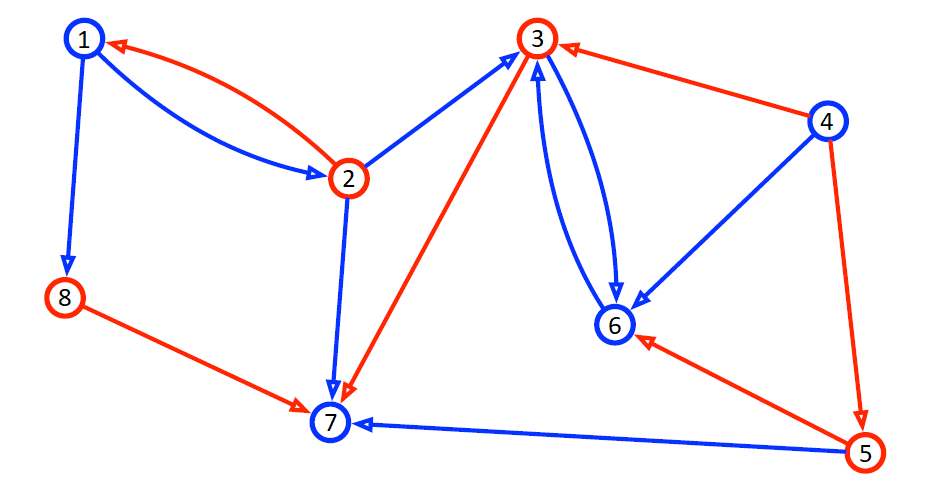

# Red Blue Graph problem solver

The problem is the following:

In a directed graph, each node is colored either red or blue. Furthermore, vertices are also colored red or blue.

When a node is deleted, its adjacent nodes are colored the same color than the vertice which made the link with the node.

Can we delete an uninterrupted sequence of k nodes with all the same color ?

### How to implement the algorithm ?

Create a new directed graph with a max capacity of 10 nodes (note that the node ids are 0 to 9).
```c++
Graph graph(10);
```
Add a node with id 0 and color blue and a node with id 1 and color red (the nodes will be deleted by the graph destructor).
```c++
Node *n0 = graph.createNode(Graph::Color::BLUE, 0);
Node *n1 = graph.createNode(Graph::Color::RED, 1);
```
Add a directed red edge from node 0 to node 1.
```c++
n0->addNeighbor(n1, Graph::Color::RED);
```
Is it possible to remove an uninterrupted sequence of k nodes with all the same red color ? Is so, the function returns the ids of the nodes to remove.
```c++
std::optional<std::deque<size_t>> sequence = graph.getSequence(Graph::Color::RED, 7);
```
Get the max sequence of red nodes it is possible to remove. The first element of the pair is the number of red nodes in the sequence and the second is the list of ids of the nodes to remove.
```c++
std::pair<size_t, std::deque<size_t>> sequenceMax = graph.getSequenceMax(Graph::Color::RED);
```

### Example

Consider the following graph:



If we want to check if there is a sequence of 7 red nodes, we can use the following code:

```c++
    Graph graph(9);
    // No node 0 for better visibility
    Node *n1 = graph.createNode(Graph::Color::BLUE, 1);
    Node *n2 = graph.createNode(Graph::Color::RED, 2);
    Node *n3 = graph.createNode(Graph::Color::RED, 3);
    Node *n4 = graph.createNode(Graph::Color::BLUE, 4);
    Node *n5 = graph.createNode(Graph::Color::RED, 5);
    Node *n6 = graph.createNode(Graph::Color::BLUE, 6);
    Node *n7 = graph.createNode(Graph::Color::BLUE, 7);
    Node *n8 = graph.createNode(Graph::Color::RED, 8);
    n1->addNeighbor(n2, Graph::Color::BLUE);
    n1->addNeighbor(n8, Graph::Color::BLUE);
    n2->addNeighbor(n1, Graph::Color::RED);
    n2->addNeighbor(n3, Graph::Color::BLUE);
    n2->addNeighbor(n7, Graph::Color::BLUE);
    n3->addNeighbor(n6, Graph::Color::BLUE);
    n3->addNeighbor(n7, Graph::Color::RED);
    n4->addNeighbor(n3, Graph::Color::RED);
    n4->addNeighbor(n5, Graph::Color::RED);
    n4->addNeighbor(n6, Graph::Color::BLUE);
    n5->addNeighbor(n6, Graph::Color::RED);
    n5->addNeighbor(n7, Graph::Color::BLUE);
    n6->addNeighbor(n3, Graph::Color::BLUE);
    n8->addNeighbor(n7, Graph::Color::RED);
    std::cout << graph << std::endl;
    std::optional<std::deque<size_t>> sequence = graph.getSequence(Graph::Color::RED, 7);
    std::cout << (sequence.has_value() ? "Sequence found" : "Sequence not found") << std::endl;
    if (sequence.has_value())
    {
        std::cout << "Sequence : ";
        for (const size_t &it: sequence.value())
        {
            std::cout << it << " ";
        }
        std::cout << std::endl;
    }
```
We get the following output: **3 2 5 6 8 1 7**

If we analyze the output:
- We remove the node 3 -> node 7 becomes red, node 6 stays blue
- We remove the node 2 -> node 7 becomes blue, node 1 becomes red
- We remove the node 5 -> node 7 stays blue, node 6 becomes red
- We remove the node 8 -> node 7 becomes red
- We remove the node 1
- We remove the node 7
